# System Architecture Analysis
<!-- generated in 0.00s -->

## Overview

- **Project**: /home/tom/github/autogrammar/op3
- **Primary Language**: python
- **Languages**: python: 49, yaml: 7, toml: 1, json: 1, shell: 1
- **Analysis Mode**: static
- **Total Functions**: 155
- **Total Classes**: 53
- **Modules**: 60
- **Entry Points**: 136

## Architecture by Module

### src.opstree.probes.builtin.physical_rpi
- **Functions**: 18
- **Classes**: 1
- **File**: `physical_rpi.py`

### src.opstree.probes.builtin.os_linux
- **Functions**: 12
- **Classes**: 2
- **File**: `os_linux.py`

### src.opstree.probes.builtin.rpi_diagnostics
- **Functions**: 12
- **File**: `rpi_diagnostics.py`

### src.opstree.probes.builtin.compositor
- **Functions**: 11
- **Classes**: 2
- **File**: `compositor.py`

### src.opstree.formats.less
- **Functions**: 8
- **Classes**: 1
- **File**: `less.py`

### src.opstree.probes.registry
- **Functions**: 7
- **Classes**: 1
- **File**: `registry.py`

### src.opstree.fleet.scanner
- **Functions**: 6
- **File**: `scanner.py`

### src.opstree.probes.builtin.runtime_container
- **Functions**: 6
- **Classes**: 1
- **File**: `runtime_container.py`

### src.opstree.diagnostics.rules
- **Functions**: 6
- **Classes**: 3
- **File**: `rules.py`

### src.opstree.layers.tree
- **Functions**: 6
- **Classes**: 2
- **File**: `tree.py`

### src.opstree.probes.builtin.service_containers
- **Functions**: 5
- **Classes**: 1
- **File**: `service_containers.py`

### src.opstree.formats.registry
- **Functions**: 5
- **Classes**: 1
- **File**: `registry.py`

### src.opstree.probes.builtin.endpoint_http
- **Functions**: 5
- **Classes**: 1
- **File**: `endpoint_http.py`

### src.opstree.probes.builtin.business_health
- **Functions**: 5
- **Classes**: 1
- **File**: `business_health.py`

### src.opstree.probes.context
- **Functions**: 4
- **Classes**: 5
- **File**: `context.py`

### src.opstree.probes.builtin.exec_adapter
- **Functions**: 4
- **Classes**: 1
- **File**: `exec_adapter.py`

### src.opstree.scanner.build
- **Functions**: 4
- **File**: `build.py`

### src.opstree.probes.base
- **Functions**: 4
- **Classes**: 3
- **File**: `base.py`

### src.opstree.snapshot.model
- **Functions**: 4
- **Classes**: 3
- **File**: `model.py`

### src.opstree.scanner.linear
- **Functions**: 3
- **Classes**: 1
- **File**: `linear.py`

## Key Entry Points

Main execution flows into the system:

### src.opstree.formats.less.LessAdapter.render
> Renderuj Snapshot → LESS.
- **Calls**: snapshot.layers.get, snapshot.layers.get, snapshot.layers.get, snapshot.layers.get, snapshot.layers.get, None.join, business_layer.data.get, business_layer.data.get

### src.opstree.formats.less.LessAdapter.parse
> Parsuj LESS → PartialSnapshot.
- **Calls**: re.search, re.finditer, re.finditer, re.finditer, re.search, PartialSnapshot, self._parse_block, LayerData

### src.opstree.cli.commands.scan.scan
> Scan a device and output snapshot.
- **Calls**: click.command, click.argument, click.option, click.option, click.option, click.option, LayerTree, ProbeRegistry

### src.opstree.probes.builtin.runtime_container.RuntimeContainerProbe._list_containers
> Lista kontenerów.
- **Calls**: _exec, ctx.execute, hasattr, _exec, _exec, None.splitlines, len, json.loads

### src.opstree.cli.commands.drift.drift
> Detect drift between intended and actual state.
- **Calls**: click.command, click.argument, click.argument, Path, Path, Snapshot.load, DriftDetector, detector.detect

### src.opstree.cli.commands.convert.convert
> Convert between configuration formats.
- **Calls**: click.command, click.argument, click.argument, click.option, Path, None.write_text, click.echo, LessAdapter

### src.opstree.probes.builtin.physical_rpi.RpiPhysicalDisplayProbe.scan
- **Calls**: self._probe_config_txt, self._extract_dsi_overlays, self._scan_drm, self._probe_wlr_randr, self._merge_wlr_into_drm, self._probe_dsi_dmesg, ProbeResult, self._probe_board_model

### src.opstree.formats.snapshot_yaml.SnapshotYamlAdapter.parse
> Parsuj snapshot.yaml → Snapshot.
- **Calls**: yaml.safe_load, None.items, Snapshot, LayerData, data.get, data.get, datetime.fromisoformat, data.get

### src.opstree.formats.less.LessAdapter._parse_block
> Parse a LESS block into key-value pairs.

Supports:
- Full-line and inline ``//`` comments (stripped).
- Multi-line values: a line ending without an u
- **Calls**: body.split, _flush, None.strip, self._is_terminated, self._unescape_value, current_parts.clear, None.rstrip, None.rstrip

### src.opstree.formats.migration_yaml.MigrationYamlAdapter.parse
> Parsuj migration.yaml → PartialSnapshot.
- **Calls**: yaml.safe_load, data.get, data.get, PartialSnapshot, LayerData, LayerData, LayerData, datetime.utcnow

### src.opstree.probes.builtin.physical_rpi.RpiPhysicalDisplayProbe._probe_wlr_randr
- **Calls**: _Exec.run, r.stdout.splitlines, results.append, r.stdout.strip, re.match, re.match, results.append, name_m.group

### src.opstree.probes.builtin.physical_rpi.RpiPhysicalDisplayProbe._probe_i2c_buses
- **Calls**: _Exec.run, r.lines, _Exec.run, re.search, int, buses.append, r.stdout.strip, m.group

### src.opstree.integrations.compat.make_compat_helpers
> Build a :class:`CompatHelpers` bundle for a downstream project.

Parameters
----------
env_var:
    Environment variable name that toggles op3 usage, 
- **Calls**: tuple, CompatHelpers, os.environ.get, op3_available, RuntimeError, SSHContext, MockContext, _build_scanner

### src.opstree.scanner.adaptive.AdaptiveScanner.scan
> Scan all layers, then run follow-ups for every anomaly.
- **Calls**: ProbeContext, self.layer_tree.topological_order, Snapshot, self.probe_registry.get, probe.can_probe, datetime.now, probe.scan, probe.anomalies

### src.opstree.probes.builtin.physical_rpi.RpiPhysicalDisplayProbe._scan_drm
- **Calls**: _Exec.run, listing.lines, re.match, m.group, _Exec.run, _Exec.run, _Exec.run, _Exec.run

### src.opstree.formats.migration_yaml.MigrationYamlAdapter.render
> Renderuj Snapshot → migration.yaml.
- **Calls**: snapshot.layers.get, snapshot.layers.get, snapshot.layers.get, yaml.dump, endpoint_layer.data.get, business_layer.data.get, ep.get, runtime_layer.data.get

### src.opstree.probes.builtin.runtime_container.RuntimeContainerProbe._detect_runtime
> Wykryj runtime i wersję.
- **Calls**: ctx.execute, hasattr, _exec, _exec, _exec, None.strip, None.strip, None.split

### src.opstree.fleet.formats.render_common_as_snapshot
- **Calls**: src.opstree.fleet.scanner._flatten_snapshot, set, src.opstree.fleet.formats._unflatten, layers_data.items, Snapshot, Snapshot, fleet.variance.fields.keys, LayerData

### src.opstree.fleet.scanner.scan_fleet
> Scan every target in ``target_execute`` concurrently.

Parameters
----------
scanner:
    A wired :class:`LinearScanner` (typically from
    :func:`op
- **Calls**: list, src.opstree.fleet.scanner.compute_variance, FleetSnapshot, target_execute.keys, FleetSnapshot, min, ThreadPoolExecutor, as_completed

### src.opstree.probes.builtin.physical_rpi.RpiPhysicalDisplayProbe._scan_backlights
- **Calls**: _Exec.run, listing.lines, None.int_, None.int_, None.int_, out.append, listing.stdout.strip, None.text

### src.opstree.probes.builtin.compositor.CompositorProbe._list_kanshi_profiles
> Parse ``~/.config/kanshi/config`` into profile dicts.
- **Calls**: _Exec.run, r.stdout.splitlines, line.strip, line.startswith, None.strip, line.startswith, profiles.append, None.append

### src.opstree.probes.builtin.os_linux.OsKernelProbe._get_uptime
- **Calls**: ctx.execute, hasattr, float, int, float, int, None.split, None.split

### src.opstree.diagnostics.rules.Rule.evaluate
> Return zero or more diagnostics produced by this rule.
- **Calls**: list, self.predicate, callable, self.message, callable, self.fix, self.evidence, Diagnostic

### src.opstree.probes.builtin.service_containers.ServiceContainersProbe._list_systemd_services
> Lista systemd services.
- **Calls**: _exec, ctx.execute, hasattr, None.splitlines, line.split, stdout.strip, len, services.append

### src.opstree.probes.builtin.exec_adapter.ProbeExec.run
- **Calls**: ctx.execute, hasattr, isinstance, cls, cls, cls, cls, bool

### src.opstree.formats.snapshot_yaml.SnapshotYamlAdapter.render
> Renderuj Snapshot → snapshot.yaml.
- **Calls**: snapshot.layers.items, hasattr, yaml.dump, hasattr, snapshot.scanned_at.isoformat, None.isoformat, hasattr, layer_data.probed_at.isoformat

### src.opstree.probes.builtin.endpoint_http.EndpointHttpProbe._check_endpoint
> Sprawdź pojedynczy endpoint.
- **Calls**: _exec, _exec, ctx.execute, hasattr, int, int, stdout.strip, float

### src.opstree.probes.builtin.endpoint_http.EndpointHttpProbe.anomalies
> Wykryj anomalie w endpointach.
- **Calls**: data.data.get, ep.get, anomalies.append, ep.get, anomalies.append, ep.get, ep.get, ep.get

### src.opstree.scanner.linear.LinearScanner.scan
> Scan all layers and return a complete snapshot.
- **Calls**: ProbeContext, self.layer_tree.topological_order, Snapshot, self.probe_registry.get, probe.can_probe, datetime.now, probe.scan, probe.anomalies

### src.opstree.probes.builtin.compositor.KanshiReconcileProbe.scan
- **Calls**: CompositorProbe._list_kanshi_profiles, _Exec.run, self._suggest_profile, ProbeResult, drm.lines, len, bool, LayerData

## Process Flows

Key execution flows identified:

### Flow 1: render
```
render [src.opstree.formats.less.LessAdapter]
```

### Flow 2: parse
```
parse [src.opstree.formats.less.LessAdapter]
```

### Flow 3: scan
```
scan [src.opstree.cli.commands.scan]
```

### Flow 4: _list_containers
```
_list_containers [src.opstree.probes.builtin.runtime_container.RuntimeContainerProbe]
```

### Flow 5: drift
```
drift [src.opstree.cli.commands.drift]
```

### Flow 6: convert
```
convert [src.opstree.cli.commands.convert]
```

### Flow 7: _parse_block
```
_parse_block [src.opstree.formats.less.LessAdapter]
```

### Flow 8: _probe_wlr_randr
```
_probe_wlr_randr [src.opstree.probes.builtin.physical_rpi.RpiPhysicalDisplayProbe]
```

### Flow 9: _probe_i2c_buses
```
_probe_i2c_buses [src.opstree.probes.builtin.physical_rpi.RpiPhysicalDisplayProbe]
```

### Flow 10: make_compat_helpers
```
make_compat_helpers [src.opstree.integrations.compat]
```

## Key Classes

### src.opstree.probes.builtin.physical_rpi.RpiPhysicalDisplayProbe
> Full hardware probe for a Raspberry Pi-class board.
- **Methods**: 18
- **Key Methods**: src.opstree.probes.builtin.physical_rpi.RpiPhysicalDisplayProbe.can_probe, src.opstree.probes.builtin.physical_rpi.RpiPhysicalDisplayProbe.scan, src.opstree.probes.builtin.physical_rpi.RpiPhysicalDisplayProbe.anomalies, src.opstree.probes.builtin.physical_rpi.RpiPhysicalDisplayProbe._probe_board_model, src.opstree.probes.builtin.physical_rpi.RpiPhysicalDisplayProbe._probe_config_txt, src.opstree.probes.builtin.physical_rpi.RpiPhysicalDisplayProbe._extract_dsi_overlays, src.opstree.probes.builtin.physical_rpi.RpiPhysicalDisplayProbe._scan_drm, src.opstree.probes.builtin.physical_rpi.RpiPhysicalDisplayProbe._probe_wlr_randr, src.opstree.probes.builtin.physical_rpi.RpiPhysicalDisplayProbe._merge_wlr_into_drm, src.opstree.probes.builtin.physical_rpi.RpiPhysicalDisplayProbe._scan_backlights

### src.opstree.formats.less.LessAdapter
> Parsuj i emituj .doql.less.
- **Methods**: 8
- **Key Methods**: src.opstree.formats.less.LessAdapter._strip_inline_comment, src.opstree.formats.less.LessAdapter._is_terminated, src.opstree.formats.less.LessAdapter._escape_value, src.opstree.formats.less.LessAdapter._unescape_value, src.opstree.formats.less.LessAdapter._render_key_value, src.opstree.formats.less.LessAdapter.parse, src.opstree.formats.less.LessAdapter.render, src.opstree.formats.less.LessAdapter._parse_block

### src.opstree.probes.builtin.os_linux.OsKernelProbe
> Skanuje jądro Linux.
- **Methods**: 7
- **Key Methods**: src.opstree.probes.builtin.os_linux.OsKernelProbe.can_probe, src.opstree.probes.builtin.os_linux.OsKernelProbe.scan, src.opstree.probes.builtin.os_linux.OsKernelProbe._get_kernel_version, src.opstree.probes.builtin.os_linux.OsKernelProbe._get_arch, src.opstree.probes.builtin.os_linux.OsKernelProbe._get_hostname, src.opstree.probes.builtin.os_linux.OsKernelProbe._get_uptime, src.opstree.probes.builtin.os_linux.OsKernelProbe.anomalies

### src.opstree.probes.builtin.compositor.CompositorProbe
> Detect Wayland compositor and kanshi availability.
- **Methods**: 7
- **Key Methods**: src.opstree.probes.builtin.compositor.CompositorProbe.can_probe, src.opstree.probes.builtin.compositor.CompositorProbe.scan, src.opstree.probes.builtin.compositor.CompositorProbe.anomalies, src.opstree.probes.builtin.compositor.CompositorProbe._detect_compositor, src.opstree.probes.builtin.compositor.CompositorProbe._compositor_version, src.opstree.probes.builtin.compositor.CompositorProbe._list_kanshi_profiles, src.opstree.probes.builtin.compositor.CompositorProbe._detect_active_profile

### src.opstree.probes.builtin.runtime_container.RuntimeContainerProbe
> Skanuje runtime kontenerów (docker/podman).
- **Methods**: 6
- **Key Methods**: src.opstree.probes.builtin.runtime_container.RuntimeContainerProbe.__init__, src.opstree.probes.builtin.runtime_container.RuntimeContainerProbe.can_probe, src.opstree.probes.builtin.runtime_container.RuntimeContainerProbe.scan, src.opstree.probes.builtin.runtime_container.RuntimeContainerProbe._detect_runtime, src.opstree.probes.builtin.runtime_container.RuntimeContainerProbe._list_containers, src.opstree.probes.builtin.runtime_container.RuntimeContainerProbe.anomalies

### src.opstree.probes.builtin.os_linux.OsConfigProbe
> Skanuje konfigurację systemu.
- **Methods**: 5
- **Key Methods**: src.opstree.probes.builtin.os_linux.OsConfigProbe.can_probe, src.opstree.probes.builtin.os_linux.OsConfigProbe.scan, src.opstree.probes.builtin.os_linux.OsConfigProbe._read_config_txt, src.opstree.probes.builtin.os_linux.OsConfigProbe._read_cmdline, src.opstree.probes.builtin.os_linux.OsConfigProbe.anomalies

### src.opstree.probes.builtin.service_containers.ServiceContainersProbe
> Skanuje systemd services.
- **Methods**: 5
- **Key Methods**: src.opstree.probes.builtin.service_containers.ServiceContainersProbe.can_probe, src.opstree.probes.builtin.service_containers.ServiceContainersProbe.scan, src.opstree.probes.builtin.service_containers.ServiceContainersProbe._list_systemd_services, src.opstree.probes.builtin.service_containers.ServiceContainersProbe._is_service_enabled, src.opstree.probes.builtin.service_containers.ServiceContainersProbe.anomalies

### src.opstree.probes.registry.ProbeRegistry
> Registry for probes keyed by ``layer_id``.

Each instance owns its own probe dict — create a fresh r
- **Methods**: 5
- **Key Methods**: src.opstree.probes.registry.ProbeRegistry.__init__, src.opstree.probes.registry.ProbeRegistry.register, src.opstree.probes.registry.ProbeRegistry.get, src.opstree.probes.registry.ProbeRegistry.all, src.opstree.probes.registry.ProbeRegistry.clear

### src.opstree.probes.builtin.endpoint_http.EndpointHttpProbe
> Skanuje HTTP endpoints.
- **Methods**: 5
- **Key Methods**: src.opstree.probes.builtin.endpoint_http.EndpointHttpProbe.__init__, src.opstree.probes.builtin.endpoint_http.EndpointHttpProbe.can_probe, src.opstree.probes.builtin.endpoint_http.EndpointHttpProbe.scan, src.opstree.probes.builtin.endpoint_http.EndpointHttpProbe._check_endpoint, src.opstree.probes.builtin.endpoint_http.EndpointHttpProbe.anomalies

### src.opstree.probes.builtin.business_health.BusinessHealthProbe
> Skanuje zdrowie aplikacji.
- **Methods**: 5
- **Key Methods**: src.opstree.probes.builtin.business_health.BusinessHealthProbe.__init__, src.opstree.probes.builtin.business_health.BusinessHealthProbe.can_probe, src.opstree.probes.builtin.business_health.BusinessHealthProbe.scan, src.opstree.probes.builtin.business_health.BusinessHealthProbe._check_health_endpoint, src.opstree.probes.builtin.business_health.BusinessHealthProbe.anomalies

### src.opstree.layers.tree.LayerTree
> Drzewo warstw — topological ordering, dependency resolution.
- **Methods**: 5
- **Key Methods**: src.opstree.layers.tree.LayerTree.__init__, src.opstree.layers.tree.LayerTree.register, src.opstree.layers.tree.LayerTree.get, src.opstree.layers.tree.LayerTree.topological_order, src.opstree.layers.tree.LayerTree.to_fraq_node

### src.opstree.formats.registry.FormatRegistry
> Registry for format adapters (wraps fraq's FormatRegistry).
- **Methods**: 4
- **Key Methods**: src.opstree.formats.registry.FormatRegistry.register, src.opstree.formats.registry.FormatRegistry.get, src.opstree.formats.registry.FormatRegistry.available, src.opstree.formats.registry.FormatRegistry.serialize

### src.opstree.probes.builtin.exec_adapter.ProbeExec
- **Methods**: 4
- **Key Methods**: src.opstree.probes.builtin.exec_adapter.ProbeExec.run, src.opstree.probes.builtin.exec_adapter.ProbeExec.text, src.opstree.probes.builtin.exec_adapter.ProbeExec.lines, src.opstree.probes.builtin.exec_adapter.ProbeExec.int_

### src.opstree.probes.builtin.compositor.KanshiReconcileProbe
> Follow-up probe: suggest a kanshi profile when DSI+HDMI are both connected.

Registered against ``ph
- **Methods**: 4
- **Key Methods**: src.opstree.probes.builtin.compositor.KanshiReconcileProbe.can_probe, src.opstree.probes.builtin.compositor.KanshiReconcileProbe.scan, src.opstree.probes.builtin.compositor.KanshiReconcileProbe.anomalies, src.opstree.probes.builtin.compositor.KanshiReconcileProbe._suggest_profile

### src.opstree.diagnostics.rules.RuleEngine
> Runs a list of :class:`Rule` objects against a subject.

Stateless and reusable; keep one per rule-s
- **Methods**: 4
- **Key Methods**: src.opstree.diagnostics.rules.RuleEngine.__init__, src.opstree.diagnostics.rules.RuleEngine.rules, src.opstree.diagnostics.rules.RuleEngine.evaluate, src.opstree.diagnostics.rules.RuleEngine.any_error
- **Inherits**: <ast.Subscript object at 0x74664c91d190>

### src.opstree.snapshot.model.Snapshot
> Pełna migawka urządzenia/systemu.
- **Methods**: 4
- **Key Methods**: src.opstree.snapshot.model.Snapshot.layer, src.opstree.snapshot.model.Snapshot.query, src.opstree.snapshot.model.Snapshot.to_yaml, src.opstree.snapshot.model.Snapshot.load
- **Inherits**: BaseModel

### src.opstree.scanner.adaptive.AdaptiveScanner
> Scanner that runs follow-up probes when anomalies are detected.

Inherits layer-tree walking from :c
- **Methods**: 3
- **Key Methods**: src.opstree.scanner.adaptive.AdaptiveScanner.__init__, src.opstree.scanner.adaptive.AdaptiveScanner.register_followup, src.opstree.scanner.adaptive.AdaptiveScanner.scan
- **Inherits**: LinearScanner

### src.opstree.probes.base.Probe
> Kontrakt probe'a.
- **Methods**: 3
- **Key Methods**: src.opstree.probes.base.Probe.can_probe, src.opstree.probes.base.Probe.scan, src.opstree.probes.base.Probe.anomalies
- **Inherits**: Protocol

### src.opstree.formats.migration_yaml.MigrationYamlAdapter
> Parsuj i emituj migration.yaml (redeploy-compatible).
- **Methods**: 2
- **Key Methods**: src.opstree.formats.migration_yaml.MigrationYamlAdapter.parse, src.opstree.formats.migration_yaml.MigrationYamlAdapter.render

### src.opstree.formats.snapshot_yaml.SnapshotYamlAdapter
> Native op3 snapshot format adapter.
- **Methods**: 2
- **Key Methods**: src.opstree.formats.snapshot_yaml.SnapshotYamlAdapter.parse, src.opstree.formats.snapshot_yaml.SnapshotYamlAdapter.render

## Data Transformation Functions

Key functions that process and transform data:

### src.opstree.formats.registry.FormatRegistry.serialize
> Serialize data using the specified format.
- **Output to**: cls._registry.serialize

### src.opstree.formats.registry.register_format
> Decorator to register a format adapter.
- **Output to**: FormatRegistry.register

### src.opstree.formats.migration_yaml.MigrationYamlAdapter.parse
> Parsuj migration.yaml → PartialSnapshot.
- **Output to**: yaml.safe_load, data.get, data.get, PartialSnapshot, LayerData

### src.opstree.formats.snapshot_yaml.SnapshotYamlAdapter.parse
> Parsuj snapshot.yaml → Snapshot.
- **Output to**: yaml.safe_load, None.items, Snapshot, LayerData, data.get

### src.opstree.formats.less.LessAdapter.parse
> Parsuj LESS → PartialSnapshot.
- **Output to**: re.search, re.finditer, re.finditer, re.finditer, re.search

### src.opstree.formats.less.LessAdapter._parse_block
> Parse a LESS block into key-value pairs.

Supports:
- Full-line and inline ``//`` comments (stripped
- **Output to**: body.split, _flush, None.strip, self._is_terminated, self._unescape_value

### src.opstree.cli.commands.convert.convert
> Convert between configuration formats.
- **Output to**: click.command, click.argument, click.argument, click.option, Path

### src.opstree.probes.builtin.physical_rpi.RpiPhysicalDisplayProbe._probe_compositor_processes
- **Output to**: _Exec.run, r.stdout.strip, int, None.split, x.strip

## Behavioral Patterns

### recursion__flatten
- **Type**: recursion
- **Confidence**: 0.90
- **Functions**: src.opstree.fleet.scanner._flatten

## Public API Surface

Functions exposed as public API (no underscore prefix):

- `src.opstree.formats.less.LessAdapter.render` - 38 calls
- `src.opstree.formats.less.LessAdapter.parse` - 37 calls
- `src.opstree.cli.commands.scan.scan` - 37 calls
- `src.opstree.cli.commands.drift.drift` - 26 calls
- `src.opstree.cli.commands.convert.convert` - 26 calls
- `src.opstree.probes.builtin.physical_rpi.RpiPhysicalDisplayProbe.scan` - 21 calls
- `src.opstree.formats.snapshot_yaml.SnapshotYamlAdapter.parse` - 19 calls
- `src.opstree.formats.migration_yaml.MigrationYamlAdapter.parse` - 18 calls
- `src.opstree.fleet.scanner.compute_variance` - 18 calls
- `src.opstree.integrations.compat.make_compat_helpers` - 16 calls
- `src.opstree.scanner.adaptive.AdaptiveScanner.scan` - 14 calls
- `src.opstree.formats.migration_yaml.MigrationYamlAdapter.render` - 13 calls
- `src.opstree.fleet.formats.render_common_as_snapshot` - 12 calls
- `src.opstree.fleet.scanner.scan_fleet` - 12 calls
- `src.opstree.diagnostics.rules.Rule.evaluate` - 10 calls
- `src.opstree.snapshot.diff.snapshot_diff` - 10 calls
- `src.opstree.probes.builtin.exec_adapter.ProbeExec.run` - 9 calls
- `src.opstree.formats.snapshot_yaml.SnapshotYamlAdapter.render` - 9 calls
- `src.opstree.probes.builtin.endpoint_http.EndpointHttpProbe.anomalies` - 9 calls
- `src.opstree.scanner.linear.LinearScanner.scan` - 9 calls
- `src.opstree.probes.builtin.compositor.KanshiReconcileProbe.scan` - 9 calls
- `src.opstree.layers.tree.LayerTree.topological_order` - 9 calls
- `src.opstree.probes.builtin.compositor.CompositorProbe.scan` - 8 calls
- `src.opstree.probes.builtin.os_linux.OsKernelProbe.scan` - 7 calls
- `src.opstree.probes.builtin.endpoint_http.EndpointHttpProbe.scan` - 7 calls
- `src.opstree.scanner.build.build_scanner` - 7 calls
- `src.opstree.probes.builtin.business_health.BusinessHealthProbe.anomalies` - 6 calls
- `src.opstree.probes.builtin.physical_rpi.RpiPhysicalDisplayProbe.anomalies` - 6 calls
- `src.opstree.probes.builtin.runtime_container.RuntimeContainerProbe.can_probe` - 6 calls
- `src.opstree.probes.builtin.runtime_container.RuntimeContainerProbe.anomalies` - 6 calls
- `src.opstree.layers.tree.LayerDefinition.to_fraq_node` - 6 calls
- `src.opstree.probes.builtin.os_linux.OsConfigProbe.scan` - 5 calls
- `src.opstree.probes.builtin.runtime_container.RuntimeContainerProbe.scan` - 5 calls
- `src.opstree.drift.detector.DriftDetector.detect` - 5 calls
- `src.opstree.probes.builtin.service_containers.ServiceContainersProbe.scan` - 4 calls
- `src.opstree.probes.builtin.service_containers.ServiceContainersProbe.anomalies` - 4 calls
- `src.opstree.fleet.formats.render_variant_matrix` - 4 calls
- `src.opstree.probes.builtin.business_health.BusinessHealthProbe.scan` - 4 calls
- `src.opstree.probes.builtin.compositor.CompositorProbe.anomalies` - 4 calls
- `src.opstree.layers.tree.LayerTree.register` - 4 calls

## System Interactions

How components interact:

```mermaid
graph TD
    render --> get
    parse --> search
    parse --> finditer
    scan --> command
    scan --> argument
    scan --> option
    _list_containers --> _exec
    _list_containers --> execute
    _list_containers --> hasattr
    drift --> command
    drift --> argument
    drift --> Path
    convert --> command
    convert --> argument
    convert --> option
    convert --> Path
    scan --> _probe_config_txt
    scan --> _extract_dsi_overlay
    scan --> _scan_drm
    scan --> _probe_wlr_randr
    scan --> _merge_wlr_into_drm
    parse --> safe_load
    parse --> items
    parse --> Snapshot
    parse --> LayerData
    parse --> get
    _parse_block --> split
    _parse_block --> _flush
    _parse_block --> strip
    _parse_block --> _is_terminated
```



## Reverse Engineering Guidelines

1. **Entry Points**: Start analysis from the entry points listed above
2. **Core Logic**: Focus on classes with many methods
3. **Data Flow**: Follow data transformation functions
4. **Process Flows**: Use the flow diagrams for execution paths
5. **API Surface**: Public API functions reveal the interface

## Context for LLM

Maintain the identified architectural patterns and public API surface when suggesting changes.